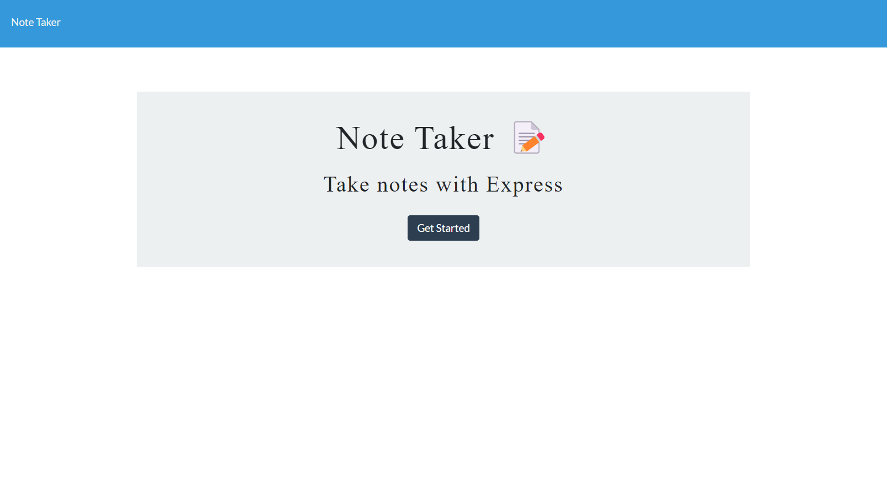
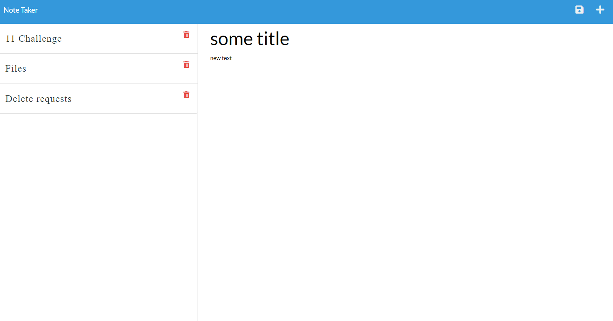

# Note-Taker

## Description
 Note Taker application can be used to write, save, and delete notes using an express backend and save and  retrieve notes data from a JSON file.
Also the application is deployed on Heroku. you can find links below.

## Installation
-Download or clone repository 
-Node.js is required to run the application 
-npm install to install the required npm packages 
 Open VsCode Terminal 
-npm start 
-You can see message "App listening on PORT 3001" 
-Open browser  http://localhost:3001/ to run this application on your local machine. 

## Images of Deployed Application

## Relevant Links